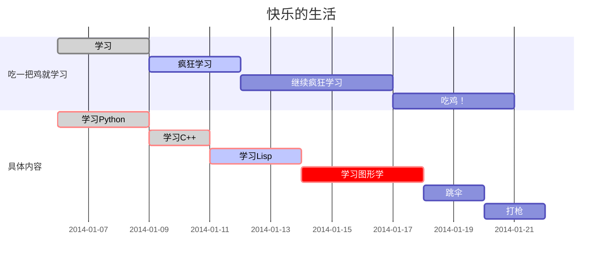

> 前段时间被一堆字符编码搞得晕头转向,一次性搞个明白.

-  字符集: 就是字符的集合，收录了一定数量的字符。每个字符有对应的ID值，叫码点（code point）。
- 编码方式: 实际存储的时候，不一定是直接存储字符串的码点（比如，为了节约空间），要进行转换。这个转换规则就是编码 
- 代码页: 是字符编码的别名，也称内码表，是特定语言的字符集的一张表。(windows cmd中输入 chcp可以查看当前使用的代码页,936表示GBK)

## 字符集

###  ASCII

标准`ascii`定义了128个字符,其中0~31 & 127(共33个)为控制字符,用来操控已经处理过的文字.95个字符为可显示字符.


### LATIN1

`ISO 8859-1`的别名, 是一个8位的字符集,以`ASCII`为基础,在空置的`0xA0-0xFF`范围内加入96个字母及符号.


在上表中，`0x20`是空格、`0xA0`是不换行空格、`0xAD`是选择性连接号。

`0x00-0x1F`、`0x7F`、`0x80-0x9F`在此字符集中未有定义。（控制字符是由`ISO/IEC 6429`定义）。

### UNICODE

>  不同于其他字符集,对于 Unicode,字符集和编码是明确区分的。 

中文又称万国码、国际码、统一码、单一码，是计算机科学领域里的一项业界标准.包含世界上大部分的文字系统.

目前的Unicode字符分为17组编排，每组称为平面（Plane），而每平面拥有65536（即216）个代码点.然而目前只用了少数平面.常使用的字符位于0号平面.

|        平面         |     始末字符值      |           中文名称            |                     英文名称                     |
| :-----------------: | :-----------------: | :---------------------------: | :----------------------------------------------: |
|       0号平面       |   U+0000 - U+FFFF   |      **基本多文种平面**       |      Basic Multilingual Plane，简称**BMP**       |
|       1号平面       |  U+10000 - U+1FFFF  |      **多文种补充平面**       |  Supplementary Multilingual Plane，简称**SMP**   |
|       2号平面       |  U+20000 - U+2FFFF  |     **表意文字补充平面**      |   Supplementary Ideographic Plane，简称**SIP**   |
|       3号平面       |  U+30000 - U+3FFFF  |     **表意文字第三平面**      |     Tertiary Ideographic Plane，简称**TIP**      |
| 4号平面 至 13号平面 |  U+40000 - U+DFFFF  |         （尚未使用）          |                                                  |
|      14号平面       |  U+E0000 - U+EFFFF  |     **特别用途补充平面**      | Supplementary Special-purpose Plane，简称**SSP** |
|      15号平面       |  U+F0000 - U+FFFFF  | 保留作为**私人使用区（A区）** |        Private Use Area-A，简称**PUA-A**         |
|      16号平面       | U+100000 - U+10FFFF | 保留作为**私人使用区（B区）** |        Private Use Area-B，简称**PUA-B**         |

**汉字 Unicode 编码范围**

> 参考网站: <a href="https://www.qqxiuzi.cn/zh/hanzi-unicode-bianma.php" target="_blank"> https://www.qqxiuzi.cn/zh/hanzi-unicode-bianma.php </a>

| **字符集**                                                   | **字数** | **Unicode 编码** |
| ------------------------------------------------------------ | -------- | ---------------- |
| 基本汉字 | 20902字  | 4E00-9FA5        |
| 基本汉字补充 | 74字     | 9FA6-9FEF        |
| 扩展A | 6582字   | 3400-4DB5        |
| 扩展B | 42711字  | 20000-2A6D6      |
| 扩展C | 4149字   | 2A700-2B734      |
| 扩展D | 222字    | 2B740-2B81D      |
| 扩展E | 5762字   | 2B820-2CEA1      |
| 扩展F | 7473字   | 2CEB0-2EBE0      |
| 扩展G | 4939字   | 30000-3134A      |
| 康熙部首 | 214字    | 2F00-2FD5        |
| 部首扩展 | 115字    | 2E80-2EF3        |
| 兼容汉字 | 477字    | F900-FAD9        |
| 兼容扩展 | 542字    | 2F800-2FA1D      |
| PUA(GBK)部件 | 81字     | E815-E86F        |
| 部件扩展 | 452字    | E400-E5E8        |
| PUA增补| 207字    | E600-E6CF        |
| 汉字笔画 | 36字     | 31C0-31E3        |
| 汉字结构 | 12字     | 2FF0-2FFB        |
| 汉语注音 | 43字     | 3105-312F        |
| 注音扩展 | 22字     | 31A0-31BA        |
| 〇      | 1字      | 3007             |

 Unicode的**实现方式**称为Unicode转换格式（Unicode Transformation Format，简称为UTF） 

###  GB2312 

 又称**信息交换用汉字编码字符集·基本集** .

`GB2312`中对所收汉字进行了“分区”处理，每区含有94个汉字／符号，共计94个区。用所在的区和位来表示字符（实际上就是码位，因此称为区位码（或许叫“区位号”更为恰当）。表示方式也称为区位码。例如“万”字在45区82位，所以“万”字的区位码是：45 82（注意，GB类汉字编码为双字节编码，因此，45相当于高位字节，82相当于低位字节）。

- 01~09区（682个）：特殊符号、数字、英文字符、制表符等，包括拉丁字母、希腊字母、日文平假名及片假名字母、俄语西里尔字母等在内的682个全角字符；
- 10~15区：空区，留待扩展；在附录3，第10区推荐作为`GB 1988–80` 中的94个图形字符区域（即第3区字符之[半形](https://zh.wikipedia.org/wiki/半形)版本）。
- 16~55区（3755个）：常用汉字（也称一级汉字），按拼音排序；
- 56~87区（3008个）：非常用汉字（也称二级汉字），按部首/笔画排序；
- 88~94区：空区，留待扩展。

### GBK

`GB2312`升级版.简体中文windows系统使用的就是`GBK`.

> 众所周知,GBK存在一些BUG 😶.

## unicode编码方式

### utf8

`utf8`是一种针对`unicode`的可变长度字符编码,用`1~4`个字节对`unicode`字符集中的码点进行编码.由于较小值的编码点一般使用频率较高(比如阿拉伯数字和英文字母)，直接使用Unicode编码效率低下，大量浪费内存空间。UTF-8就是为了解决向后兼容ASCII码而设计，Unicode中前128个字符（与ASCII码一一对应），使用与ASCII码相同的二进制值的单个字节进行编码。因此，它逐渐成为电子邮件、网页及其他存储或发送文字优先采用的编码方式。

编码规则

- 在ASCII码(0x00~0x7f)的范围，用一个字节表示，超出ASCII码的范围就用字节表示，这様的好处是当UNICODE文件中只有ASCII码时，存储的文件都为一个字节，所以就是普通的ASCII文件无异，读取的时候也是如此，所以能与以前的ASCII文件兼容。
- 大于ASCII码的，就会由上面的第一字节的前几位表示该unicode字符的长度，比如110xxxxx前三位的二进制表示告诉我们这是个`2byte`的UNICODE字符；1110xxxx是个`3byte`的UNICODE字符，依此类推；xxx的位置由字符编码数的二进制表示的位填入。越靠右的x具有越少的特殊意义。只用最短的那个足够表达一个字符编码数的多字节串。注意在多字节串中，第一个字节的开头"1"的数目就是整个串中字节的数目。

`utf8`单字节表示法: `0xxxxxxx`, 码点范围: `U+0000 ~ U+007F`

`utf8`双字节表示法: `110xxxxx xxxxxxxx`, 码点范围: `U+0080 ~ U+07FF`

`utf8`三字节表示法: `1110xxxx 10xxxxxx 10xxxxxx`, 码点范围: `U+0800 ~ U+FFFF`

`utf8`四字节表示法: ` 11110xxx  10xxxxxx 10xxxxxx 10xxxxxx`, 码点范围: `U+10000 ~ U+1FFFFF`

可以得出结论: **UTF8编码中,ASCII字母使用1字节存储，重音文字、希腊字母或西里尔字母等使用2字节来存储，而常用的汉字就要使用3字节。辅助平面字符则使用4字节。**

### utf16

`utf16` 需要1个或者2个16位长的码元来表示，是一个变长表示 .

 **代理项**，是一种在 UTF-16 中用来表示补充字符的方法 .当码点超过BMP平面时,需要用2个16位长码元来表示这个字符.

**代理对**

**高代理项代码点**（High-Surrogate Code Point）：在 U+D800 到 U+DBFF 范围内的 `Unicode`代码点。

**低代理项代码点**（Low-Surrogate Code Point）：在 U+DC00 到 U+DFFF 范围内的 `Unicode` 代码点。

计算公式:

```javascript
// c表示unicode码点
// **高代理项代码点**
high = Math.floor((c-0x10000) / 0x400)+0xD800
// **低代理项代码点**
low = (c - 0x10000) % 0x400 + 0xDC00
```

### utf32

UTF-32`使用32位长(4字节),定长.

`UTF-32`的主要缺点是每个码位使用四个字节，空间浪费较多。在大多数文本中，非基本多文种平面的字符非常罕见，这使得UTF-32所需空间接近UTF-16的两倍和UTF-8的四倍（具体取决于文本中ASCII字符的比例）。

## 附

### Unicode在js中的表示

js使用Unicode字符集

 js允许直接用码点表示Unicode字符，写法是"反斜杠+u+码点"。 

```js
console.log('\u{4e00}' === '一')
// true 汉字 '一' 的码点是 4e00
```

### emoji

`unicode`支持`emoji`表情.  搜索emoji: https://emojipedia.org/ 

```js
console.log('\u{262F}')
// "☯" 阴阳八卦
```

### unicode组合字符

 组合字符( Combining character )是用来改变其它字符所用的字符 .

 常的用法为：将组合字符 **置于需要修饰的目标字符后边**，使目标字符被渲染（或打印）成相应结果 

```js
console.log('\u{0041}\u{0361}')
// A͡
console.log('\u{2764}\u{FE0F}')
// ❤️   \u{FE0F}作修饰
```

### 关于ANSI

`ANSI` 泛指最早每种国家语言各自实现的扩展编码方式，各个编码互相之间不兼容，比较省空间 .比如`GBK`.

### UCS-2与UTF-16

 UCS-2对每一个Unicode码位使用16位长的码元来表示(定长).

UTF-16可看成是UCS-2的父集。在没有辅助平面字符（surrogate code points）前，UTF-16与UCS-2所指的是同一的意思。但当引入辅助平面字符后，就称为UTF-16了。现在若有软件声称自己支持UCS-2编码，那其实是暗指它不能支持在UTF-16中超过2字节的字集。对于小于0x10000的UCS码，UTF-16编码就等于UCS码。

### js默认编码方式

- 对于js引擎: ` UCS-2 or UTF-16 `,大部分是`UTF-16`
- 对于 ECMAScript : `UCS-2`



