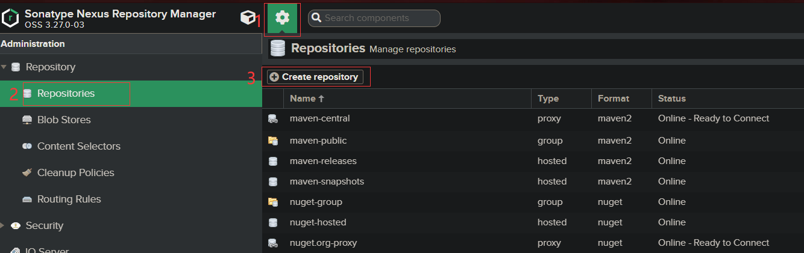

## install 

```sh
sudo docker volume create nexus-data
sudo docker run --rm -d -p 7776:7776 -p 7777:8081  --name=nexus --privileged=true  -v nexus-data:/nexus-data sonatype/nexus3:latest
```

hosted:

proxy:

group:

## npm仓库

## docker仓库

